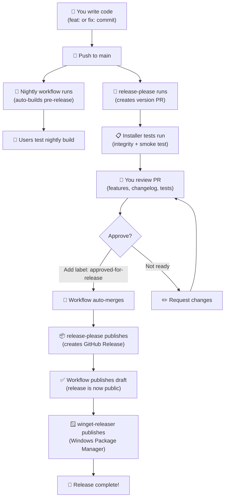

# CI/CD Pipeline Revamp - Implementation Summary

## Overview

Your CI/CD pipeline has been modernized with the following improvements:

1. **Optimized Test Workflow** - Skip tests on doc-only changes
2. **Hybrid Installer Testing** - Automated integrity checks + silent install validation
3. **Nightly Pre-release Builds** - Auto-build on feat/fix commits  
4. **Smart Release Approval** - Label-based approval gate for publishing
5. **Streamlined Release Flow** - Manual review → Auto-merge → Auto-publish

---

## Updated Workflows

### 1. **test.yml** - Testing Workflow
**Trigger:** Push/PR on `main`, `develop`, `refactor/**`  
**Optimization:** Skips tests when only markdown/docs files change

**What changed:**
```yaml
on:
  push:
    branches: [main, develop, refactor/**]
    paths-ignore:
      - 'docs/**'
      - '**.md'
```

**Benefits:**
- ✅ Faster feedback on doc updates
- ✅ CI resources only used for code changes
- ✅ Tests still run on all code modifications

---

### 2. **build-release.yml** - Release Installer Build  
**Trigger:** PR to `main` (release-please) → Release event

**New Testing Steps:**

#### A. **Integrity Testing**
- ✅ Verifies EXE and ZIP files exist
- ✅ Checks file sizes are reasonable (EXE > 10MB, ZIP > 5MB)
- ✅ Validates ZIP archive contents (not empty, readable)

#### B. **Smoke Testing (Silent Install)**
- ✅ Installs to `C:\Program Files\OverKeys-Test` silently
- ✅ Verifies app executable exists post-installation
- ✅ Attempts to launch the app for 5 seconds
- ✅ Silently uninstalls after test
- ✅ Catches: corruption, missing files, install failures, launch crashes

**PR Comment includes:**
```
## Release Installers Built

🧪 Automated Tests: ✅ PASSED
- ✅ File Integrity
- ✅ Installation & Launch

📦 Artifacts Created:
- overkeys_0.3.3_x64_setup.exe (InnoSetup Installer)
- overkeys_0.3.3_x64.zip (Portable ZIP)

✅ Automated checks passed. Ready to merge when you've verified the features.
```

**Your responsibility:** Review features/changes in the release-please PR. Automated tests verify installer integrity.

---

### 3. **nightly-build.yml** - Automatic Pre-release Builds ⭐ NEW
**Trigger:** Push to `main` with `feat:` or `fix:` commit message

**How it works:**
1. Detects commit type from commit message
2. Generates version: `feat-nightly.20260102-abc1234`
3. Builds full installers
4. Runs integrity tests
5. Creates GitHub pre-release (automatically published, marked as pre-release)

**Example flow:**
```
You merge: "feat: Add keyboard customization"
    ↓ (webhook triggers on push to main)
Nightly workflow starts
    ↓
Detects "feat:" prefix
    ↓
Builds v0.3.3-feat-nightly.20260102
    ↓
Integrity tests pass
    ↓
Creates pre-release on GitHub
    ↓
Users can download to test new features
```

**Pre-release badges:**
- 🟠 **Pre-release** (not the "latest" release)
- 🟡 **Marked unstable** (users expect bugs)
- 🟢 **Downloadable** (users can opt-in to test)

**Benefits:**
- Early testing feedback loop
- Separates nightly builds from official releases
- Zero extra configuration needed

---

### 4. **release-approval.yml** - Release Publishing Approval ⭐ NEW
**Trigger:** PR labeled with `approved-for-release`

**Workflow:**
```
release-please creates PR: "chore: release v0.3.3"
    ↓
release-approval.yml adds comment with instructions
    ↓
You review changelog, features, and release content
    ↓
You add label: "approved-for-release" (or react ✅)
    ↓
Workflow auto-merges the PR
    ↓
release-please creates GitHub Release (draft)
    ↓
Workflow publishes the draft (makes it public)
    ↓
winget-releaser auto-triggers → publishes to Windows Package Manager
```

**Your workflow:**
1. **Review** release-please PR (features, version bump, changelog)
2. **Verify** installer tests passed (see PR comments)
3. **Approve** by adding label `approved-for-release`
4. **Done** - everything else is automatic

**What you avoid:**
- ❌ Manually clicking "Publish Release" on GitHub
- ❌ Waiting for GitHub UI load
- ❌ Forgetting to publish (release stays draft)

---

### 5. **release-please.yml** - No changes
Uses existing conventional commit detection.

---

### 6. **build-release.yml** - Minor changes
- Installer tests now report results in PR comment
- Tests must pass (workflow fails if integrity/install tests fail)
- You can still ignore failures and merge if needed (emergency override)

---

## Complete Release Flow (New)



---

## Key Timings

| Step | Duration | Notes |
|------|----------|-------|
| Push to main | Immediate | Nightly build starts ~5s |
| Nightly build complete | ~5 minutes | (Includes installer tests) |
| release-please creates PR | ~30 seconds | After your last commit |
| Installer tests on PR | ~3 minutes | Integrity + smoke test |
| You review | ⏱️ Manual | Typically 5-30 minutes |
| Auto-merge to publish | ~1 minute | After you add label |
| winget publish | ~5 minutes | Platform-side delay |
| **Total time to release** | ~15 minutes | (After you approve) |

---

## Files Modified

### Workflows Updated
- `test.yml` - Added paths-ignore for docs
- `build-release.yml` - Added integrity + smoke tests

### Workflows Created
- `nightly-build.yml` - Auto pre-release builds
- `release-approval.yml` - Smart approval gate

### No Changes
- `release-please.yml` - Works as before
- `winget-releaser.yml` - Triggers on published releases

---

## Labels to Create

Go to GitHub → Settings → Labels and create this label:

**Label:** `approved-for-release`  
**Color:** Any (e.g., green #28a745)  
**Description:** "Approved for automatic merge and release publication"

---

## Testing the New Workflows

### Test 1: Nightly Build
```bash
git commit -m "feat: Add test feature"
git push origin main
# Check: https://github.com/conventoangelo/OverKeys/actions
# Look for nightly-build.yml run
```

### Test 2: Release Tests
Create a release-please PR manually (trigger main push):
- Verify installer tests run on PR
- Check PR comment shows test results

### Test 3: Approval Flow
- Create a branch with a test commit (feat: or fix:)
- Create a draft PR
- Simulate by manually triggering workflows

---

## Troubleshooting

### Nightly build not triggering?
- Commit message must start with `feat:` or `fix:`
- Must be pushed to `main` branch
- Check Actions tab for workflow status

### Release tests failing?
- Check installer build logs
- Verify InnoSetup compiled valid EXE
- Smoke test failure means the app crashes on launch

### Auto-merge not working?
- Ensure label `approved-for-release` exists
- Ensure PR is from release-please[bot]
- Check if PR has merge conflicts

---

## Future Enhancements

If needed later, consider:
1. ✅ Dependabot for dependency updates (not urgent)
2. ✅ Scheduled macOS/Linux builds (no current support)
3. ✅ Signed installers (Windows Code Signing Certificate)
4. ✅ Release notes auto-generation from commits
5. ✅ Slack notifications on nightly builds

---

## Summary

You now have:
- ✅ **Faster tests** (skip docs)
- ✅ **Safer releases** (hybrid installer testing)
- ✅ **Nightly builds** (auto pre-releases for testing)
- ✅ **Approval gates** (label-based safe publishing)
- ✅ **Automated publishing** (less manual work)

All while maintaining **manual control** over when releases go public.
